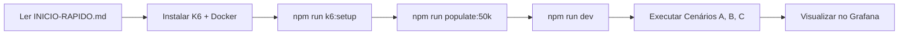
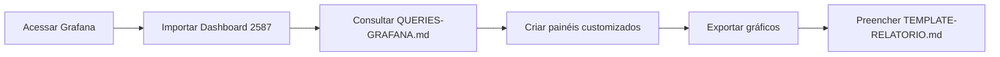
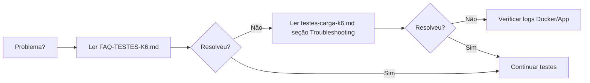

# 📚 Índice Completo - Documentação de Testes de Carga

## Navegação Rápida

Este documento serve como índice central para toda a documentação relacionada aos testes de desempenho do Financial Transaction Service.

---

## 🚀 Por Onde Começar?

### Para Iniciantes (Primeira Vez)
1. 📖 **[INICIO-RAPIDO.md](../INICIO-RAPIDO.md)** - Guia de 5 minutos
2. 📖 **[RESUMO-TESTES-K6.md](../RESUMO-TESTES-K6.md)** - Visão geral executiva
3. 📖 **[testes-carga-k6.md](./testes-carga-k6.md)** - Guia completo passo a passo

### Para Usuários Experientes
1. 📖 **[k6/README.md](../k6/README.md)** - Sobre os scripts de teste
2. 📖 **[grafana/QUERIES-GRAFANA.md](../grafana/QUERIES-GRAFANA.md)** - Queries prontas
3. 📖 **[FAQ-TESTES-K6.md](../FAQ-TESTES-K6.md)** - Perguntas frequentes

---

## 📂 Estrutura da Documentação

### 1. Guias Principais

#### 📘 [INICIO-RAPIDO.md](../INICIO-RAPIDO.md)
**Ideal para**: Primeira execução  
**Tempo de leitura**: 5 minutos  
**Conteúdo**:
- Passos rápidos para executar os testes
- Comandos essenciais
- Acesso ao Grafana
- Troubleshooting básico

#### 📗 [RESUMO-TESTES-K6.md](../RESUMO-TESTES-K6.md)
**Ideal para**: Visão geral do projeto  
**Tempo de leitura**: 10 minutos  
**Conteúdo**:
- Estrutura completa de arquivos
- Resumo dos 3 cenários
- Interpretação de resultados
- Checklist de execução
- Template de relatório

#### 📕 [testes-carga-k6.md](./testes-carga-k6.md)
**Ideal para**: Guia detalhado completo  
**Tempo de leitura**: 30 minutos  
**Conteúdo**:
- Configuração passo a passo
- População do banco de dados
- Execução detalhada dos testes
- Análise profunda de resultados
- Comparação de datasets (50k vs 20k)
- Troubleshooting avançado

---

### 2. Documentação Técnica

#### 📄 [k6/README.md](../k6/README.md)
**Ideal para**: Entender os scripts de teste  
**Conteúdo**:
- Descrição dos scripts K6
- Como customizar cenários
- Estrutura das operações testadas
- Métricas monitoradas

#### 📄 [grafana/QUERIES-GRAFANA.md](../grafana/QUERIES-GRAFANA.md)
**Ideal para**: Criar dashboards no Grafana  
**Conteúdo**:
- Queries InfluxDB prontas para usar
- Como configurar painéis
- Layout recomendado de dashboard
- Queries avançadas para comparação

#### 📄 [TEMPLATE-RELATORIO.md](./TEMPLATE-RELATORIO.md)
**Ideal para**: Documentar resultados oficialmente  
**Conteúdo**:
- Template de relatório profissional
- Tabelas para preencher resultados
- Seções de análise e recomendações
- Formato para aprovação

---

### 3. Suporte e Referência

#### ❓ [FAQ-TESTES-K6.md](../FAQ-TESTES-K6.md)
**Ideal para**: Resolver problemas comuns  
**Conteúdo**:
- 36+ perguntas e respostas
- Problemas de instalação
- Erros durante execução
- Dúvidas sobre métricas
- Dicas avançadas

---

## 🗺️ Mapa Mental

```
📚 Documentação de Testes
│
├── 🚀 Começar
│   ├── INICIO-RAPIDO.md .......... 5 min para executar testes
│   └── RESUMO-TESTES-K6.md ....... Visão geral do projeto
│
├── 📖 Guias Detalhados
│   ├── testes-carga-k6.md ........ Guia completo (30 min)
│   └── k6/README.md .............. Sobre os scripts
│
├── 🔧 Configuração
│   ├── docker-compose-k6.yml ..... InfluxDB + Grafana
│   ├── grafana/datasources ....... Configuração InfluxDB
│   └── grafana/dashboards ........ Configuração dashboards
│
├── 📊 Visualização
│   └── grafana/QUERIES-GRAFANA.md  Queries prontas
│
├── 📝 Relatórios
│   └── TEMPLATE-RELATORIO.md ..... Template oficial
│
└── ❓ Ajuda
    └── FAQ-TESTES-K6.md .......... 36+ perguntas
```

---

## 📋 Fluxo de Trabalho Recomendado

### Primeira Execução



### Análise de Resultados



### Troubleshooting



---

## 🎯 Objetivos de Cada Documento

| Documento | Objetivo | Público-Alvo |
|-----------|----------|--------------|
| **INICIO-RAPIDO.md** | Executar testes rapidamente | Iniciantes |
| **RESUMO-TESTES-K6.md** | Visão geral do projeto | Gestores, Devs |
| **testes-carga-k6.md** | Guia completo e detalhado | Equipe técnica |
| **k6/README.md** | Explicar scripts de teste | Desenvolvedores |
| **QUERIES-GRAFANA.md** | Facilitar criação de dashboards | Analistas, DevOps |
| **TEMPLATE-RELATORIO.md** | Documentar resultados oficialmente | QA, Gestores |
| **FAQ-TESTES-K6.md** | Resolver problemas comuns | Todos |

---

## 📚 Documentação Relacionada

### Documentação da API
- **[api-endpoints.md](./api-endpoints.md)** - Endpoints da API REST
- **[testes-unitarios.md](./testes-unitarios.md)** - Testes unitários com Jest

### Documentação do Projeto
- **[README.md](../README.md)** - Visão geral do projeto
- **[package.json](../package.json)** - Scripts disponíveis

---

## 🔗 Links Externos Úteis

### Ferramentas
- **K6 Docs**: https://k6.io/docs/
- **Grafana Docs**: https://grafana.com/docs/
- **InfluxDB Docs**: https://docs.influxdata.com/influxdb/v1.8/

### Comunidades
- **K6 Community**: https://community.k6.io/
- **Grafana Community**: https://community.grafana.com/

### Tutoriais
- **K6 Learn**: https://k6.io/learn/
- **Grafana Tutorials**: https://grafana.com/tutorials/

---

## 🔍 Busca Rápida por Tópico

### Instalação
- INICIO-RAPIDO.md → Seção "Passos Rápidos"
- FAQ-TESTES-K6.md → Q1, Q2, Q3

### População do Banco
- testes-carga-k6.md → Seção "População do Banco de Dados"
- FAQ-TESTES-K6.md → Q4, Q5, Q6, Q7

### Execução de Testes
- INICIO-RAPIDO.md → Seção "Executar os Testes"
- testes-carga-k6.md → Seção "Executando os Testes"
- FAQ-TESTES-K6.md → Q8, Q9, Q10, Q11, Q12

### Grafana
- INICIO-RAPIDO.md → Seção "Primeiro Dashboard"
- QUERIES-GRAFANA.md → Todas as queries
- FAQ-TESTES-K6.md → Q13, Q14, Q15, Q16

### Problemas Comuns
- FAQ-TESTES-K6.md → Q17, Q18, Q19, Q20
- testes-carga-k6.md → Seção "Troubleshooting"

### Análise de Resultados
- testes-carga-k6.md → Seção "Análise dos Resultados"
- RESUMO-TESTES-K6.md → Seção "Interpretação dos Resultados"
- FAQ-TESTES-K6.md → Q21, Q22, Q23, Q24

### Comparação de Datasets
- testes-carga-k6.md → Seção "Comparação de Datasets"
- FAQ-TESTES-K6.md → Q25, Q26

### Customização
- k6/README.md → Seção "Customização"
- FAQ-TESTES-K6.md → Q27, Q28, Q29

---

## 📊 Tabela de Referência Rápida

| Preciso... | Veja... |
|------------|---------|
| Executar pela primeira vez | INICIO-RAPIDO.md |
| Entender o projeto | RESUMO-TESTES-K6.md |
| Configurar tudo detalhadamente | testes-carga-k6.md |
| Criar dashboard no Grafana | QUERIES-GRAFANA.md |
| Resolver um erro | FAQ-TESTES-K6.md |
| Documentar resultados | TEMPLATE-RELATORIO.md |
| Modificar os testes | k6/README.md |
| Comparar 50k vs 20k | testes-carga-k6.md → Seção "Comparação" |

---

## ✅ Checklist de Leitura

Para dominar completamente os testes de carga:

- [ ] Ler INICIO-RAPIDO.md
- [ ] Executar os 3 cenários pela primeira vez
- [ ] Ler RESUMO-TESTES-K6.md
- [ ] Ler testes-carga-k6.md (guia completo)
- [ ] Configurar dashboard no Grafana com QUERIES-GRAFANA.md
- [ ] Ler FAQ-TESTES-K6.md
- [ ] Executar testes com 50k registros
- [ ] Executar testes com 20k registros
- [ ] Preencher TEMPLATE-RELATORIO.md
- [ ] Compartilhar resultados com a equipe

---

## 🎓 Níveis de Conhecimento

### Iniciante
**Leia**: INICIO-RAPIDO.md  
**Faça**: Execute um cenário com os scripts prontos  
**Tempo**: 30 minutos

### Intermediário
**Leia**: RESUMO-TESTES-K6.md + testes-carga-k6.md  
**Faça**: Execute todos os cenários e visualize no Grafana  
**Tempo**: 2 horas

### Avançado
**Leia**: Toda a documentação + FAQ  
**Faça**: Customize testes, crie dashboards, compare datasets  
**Tempo**: 1 dia

### Expert
**Leia**: Documentação + Links externos  
**Faça**: Integre com CI/CD, otimize a aplicação baseado nos testes  
**Tempo**: 1 semana

---

## 🔄 Atualizações da Documentação

**Última revisão**: ___/___/___  
**Próxima revisão**: ___/___/___

### Histórico de Mudanças
- ___/___/___ - Criação inicial
- ___/___/___ - [Adicione aqui]

### Contribuindo
Encontrou algo que pode ser melhorado? 
1. Edite o documento
2. Atualize este índice se necessário
3. Compartilhe com a equipe

---

**Boa sorte com os testes! 🚀**

Se tiver dúvidas, comece pelo FAQ ou entre em contato com a equipe.
